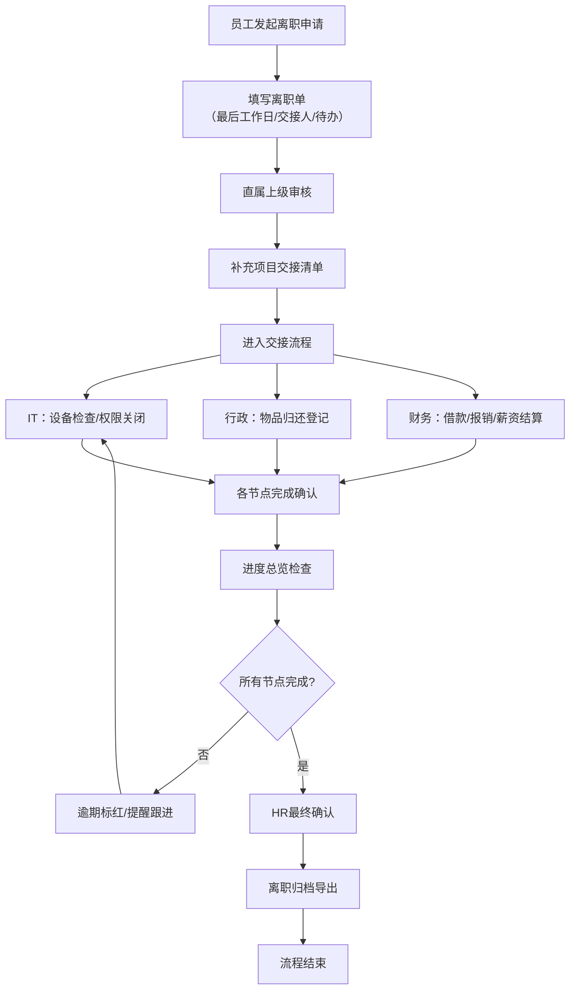

## 1. 产品概述

人力资源离职交接 Web 应用，用于离职员工、直属上级、IT、行政和财务多角色协同完成离职交接全流程。解决传统交接流程信息分散、进度不透明、遗漏风险高等问题，实现规范化、可视化、可追溯的离职管理。

- 核心目标：确保离职交接流程高效、完整、合规
- 目标用户：离职员工、直属上级、IT管理员、行政人员、财务人员、HR
- 产品价值：降低交接风险、提升效率、完整留痕、可追溯审计

## 2. 核心功能

### 2.1 用户角色

| 角色 | 权限说明 |
|------|----------|
| 离职员工 | 填写离职单（最后工作日、交接人、待办事项），查看交接进度，上传附件，填写意见 |
| 直属上级 | 审核离职单，补充项目交接清单，确认任务完成，填写审批意见 |
| IT管理员 | 处理账号关闭、邮箱转交、设备检查等 IT 相关交接事项 |
| 行政人员 | 登记门禁卡、工牌、办公用品归还情况 |
| 财务人员 | 确认借款、报销、薪资结算等财务事项 |
| HR管理员 | 进度总览，离职归档导出，系统配置 |

### 2.2 功能模块

1. **离职单页面**：员工填写离职信息、上级审核确认
2. **交接任务页面**：项目交接清单、待办事项、完成确认
3. **资产归还页面**：IT设备检查、行政物品归还登记
4. **权限关闭页面**：账号关闭、邮箱转交、系统权限回收
5. **结算确认页面**：借款核对、报销处理、薪资结算
6. **进度总览页面**：全局进度可视化、节点提醒、逾期预警
7. **归档导出功能**：离职档案导出、交接记录下载

### 2.3 页面详情

| 页面名称 | 模块名称 | 功能描述 |
|-----------|-------------|---------------------|
| 离职单 | 基本信息 | 填写离职原因、最后工作日、交接人信息 |
| 离职单 | 待办事项 | 员工填写个人待交接事项清单 |
| 离职单 | 上级审核 | 直属上级补充项目交接清单并确认 |
| 交接任务 | 任务列表 | 展示所有交接任务，支持按角色筛选 |
| 交接任务 | 任务管理 | 任务分配、进度更新、完成标记 |
| 交接任务 | 意见留痕 | 各角色填写交接意见，完整记录沟通历史 |
| 资产归还 | IT资产 | 设备型号、编号检查，完好状态确认 |
| 资产归还 | 行政物品 | 门禁卡、工牌、办公用品归还登记 |
| 资产归还 | 附件上传 | 支持上传资产交接凭证、签字扫描件 |
| 权限关闭 | 账号管理 | 系统账号、VPN、权限组关闭勾选 |
| 权限关闭 | 邮箱处理 | 邮箱转交、自动回复设置、邮件备份 |
| 权限关闭 | 确认签字 | IT管理员确认完成，记录操作时间 |
| 结算确认 | 借款核对 | 未结清借款清单及处理方式 |
| 结算确认 | 报销处理 | 待报销单据审核及支付状态 |
| 结算确认 | 薪资结算 | 最后薪资、年假、补偿金等计算确认 |
| 进度总览 | 流程图 | 交接全流程可视化进度展示 |
| 进度总览 | 节点提醒 | 待办事项提醒、节点超时预警 |
| 进度总览 | 逾期标红 | 超期未完成节点红色高亮显示 |
| 归档导出 | 档案生成 | 自动生成完整离职交接档案包 |
| 归档导出 | 下载功能 | 支持 PDF/Excel 格式导出交接记录 |

## 3. 核心流程

### 3.1 主流程描述

1. 员工发起离职申请，填写离职单（基本信息、待办事项）
2. 直属上级审核离职单，补充项目交接清单，确认任务分配
3. 进入并行交接阶段：IT处理资产和权限、行政登记物品归还、财务处理结算
4. 各角色完成各自交接事项后标记完成，填写意见
5. 所有节点完成后，HR进行最终确认，归档并导出离职档案

### 3.2 流程图

## 4. 用户界面设计

### 4.1 设计风格

- **主色调**：深蓝色系（#1e3a5f）作为主色，传递专业、可信赖的企业级产品气质
- **辅助色**：橙色（#f97316）用于强调和提醒，红色（#dc2626）用于逾期预警，绿色（#16a34a）用于完成状态
- **按钮风格**：圆角矩形（8px），带微妙阴影，hover时有微交互
- **字体**：使用系统无衬线字体族，标题加粗，正文常规
- **布局风格**：左侧导航栏 + 右侧内容区，卡片式布局，清晰的信息层级
- **图标风格**：线性图标，简洁统一，配合文字标签使用

### 4.2 页面设计概览

| 页面名称 | 模块名称 | UI元素 |
|-----------|-------------|-------------|
| 离职单 | 基本信息区 | 表单卡片、下拉选择器、日期选择器、输入框 |
| 交接任务 | 任务列表 | 任务卡片、状态标签、进度条、角色头像 |
| 资产归还 | 物品清单 | 表格、复选框、状态徽章、上传组件 |
| 权限关闭 | 权限列表 | 分组卡片、开关组件、操作时间戳 |
| 结算确认 | 财务明细 | 金额展示、计算表格、确认按钮 |
| 进度总览 | 流程可视化 | 时间线/流程图、节点状态、颜色编码 |
| 归档导出 | 操作区 | 导出按钮、格式选择、预览弹窗 |

### 4.3 响应式设计

- 桌面端优先设计（≥1280px）
- 平板端（768px-1279px）：导航栏可折叠，内容区自适应
- 移动端（<768px）：顶部导航，内容垂直堆叠，表格支持横向滚动

### 4.4 交互与动效

- 页面加载时卡片依次淡入（staggered animation）
- 状态切换时有平滑过渡动画
- 表单校验错误时摇晃提示
- 进度更新时进度条有平滑增长动效
- Hover状态有微妙的阴影和颜色变化
