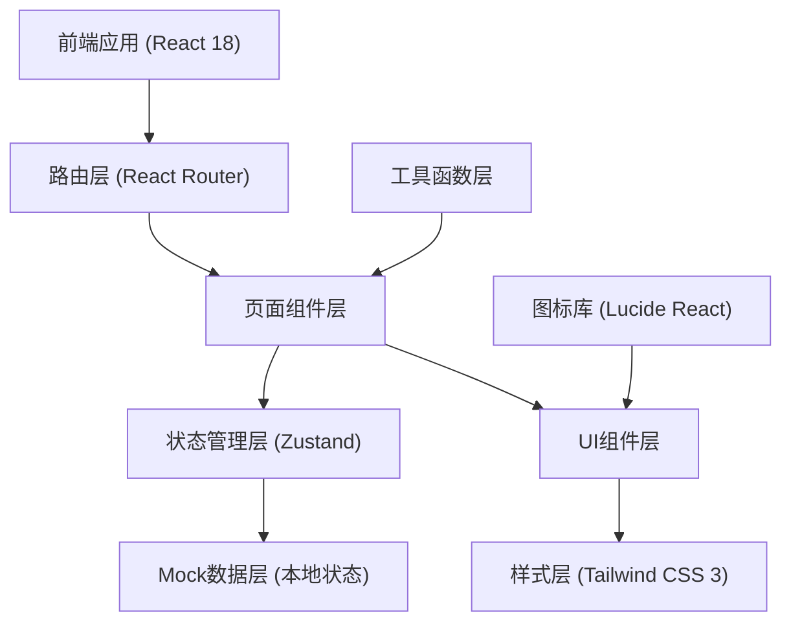
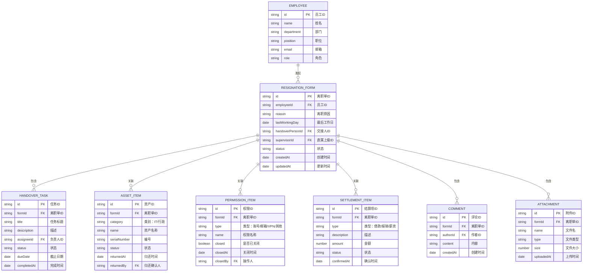

## 1. 架构设计



## 2. 技术描述

- **前端框架**: React 18 + TypeScript
- **构建工具**: Vite 5
- **路由管理**: React Router 6
- **状态管理**: Zustand（轻量级状态管理，适合中小规模应用）
- **样式方案**: Tailwind CSS 3
- **图标库**: Lucide React
- **日期处理**: date-fns
- **后端**: 无（前端 Mock 数据，本地状态持久化到 localStorage）
- **数据存储**: localStorage（本地模拟持久化）
- **导出功能**: 前端生成 PDF/Excel（使用 jspdf + xlsx 库）

## 3. 路由定义

| 路由 | 页面名称 | 说明 |
|-------|---------|------|
| / | 进度总览 | 首页，展示交接全流程进度和概览 |
| /resignation-form | 离职单 | 员工填写离职信息，上级审核 |
| /handover-tasks | 交接任务 | 项目交接清单和任务管理 |
| /asset-return | 资产归还 | IT设备和行政物品归还登记 |
| /permission-close | 权限关闭 | 账号、邮箱、权限关闭处理 |
| /settlement | 结算确认 | 借款、报销、薪资结算确认 |
| /archive | 离职归档 | 档案预览和导出功能 |

## 4. 数据模型

### 4.1 数据模型定义



### 4.2 Mock 数据结构

```typescript
// 员工信息
interface Employee {
  id: string;
  name: string;
  department: string;
  position: string;
  email: string;
  role: 'employee' | 'supervisor' | 'it' | 'admin' | 'finance' | 'hr';
  avatar?: string;
}

// 离职单
interface ResignationForm {
  id: string;
  employeeId: string;
  reason: string;
  lastWorkingDay: string;
  handoverPersonId: string;
  supervisorId: string;
  status: 'draft' | 'pending' | 'in_progress' | 'completed' | 'archived';
  createdAt: string;
  updatedAt: string;
  employeeTodos: string[];
  supervisorNotes: string;
}

// 交接任务
interface HandoverTask {
  id: string;
  formId: string;
  title: string;
  description: string;
  category: 'project' | 'document' | 'knowledge' | 'other';
  assigneeId: string;
  status: 'pending' | 'in_progress' | 'completed' | 'overdue';
  dueDate: string;
  completedAt?: string;
  priority: 'high' | 'medium' | 'low';
}

// 资产项
interface AssetItem {
  id: string;
  formId: string;
  category: 'it' | 'admin';
  name: string;
  serialNumber: string;
  status: 'not_returned' | 'returned' | 'damaged';
  returnedAt?: string;
  returnedBy?: string;
  notes?: string;
}

// 权限项
interface PermissionItem {
  id: string;
  formId: string;
  type: 'account' | 'email' | 'vpn' | 'system' | 'database';
  name: string;
  closed: boolean;
  closedAt?: string;
  closedBy?: string;
  notes?: string;
}

// 结算项
interface SettlementItem {
  id: string;
  formId: string;
  type: 'loan' | 'reimbursement' | 'salary' | 'annual_leave' | 'compensation';
  description: string;
  amount: number;
  status: 'pending' | 'confirmed' | 'paid';
  confirmedAt?: string;
  confirmedBy?: string;
}

// 意见/评论
interface Comment {
  id: string;
  formId: string;
  authorId: string;
  content: string;
  createdAt: string;
  category: 'general' | 'task' | 'asset' | 'permission' | 'settlement';
}

// 附件
interface Attachment {
  id: string;
  formId: string;
  name: string;
  type: string;
  size: number;
  uploadedAt: string;
  uploadedBy: string;
  dataUrl?: string;
}
```

## 5. 目录结构

```
src/
├── components/          # 通用UI组件
│   ├── Layout/          # 布局组件（侧边栏、顶部栏）
│   ├── Card/            # 卡片组件
│   ├── StatusBadge/     # 状态标签
│   ├── ProgressBar/     # 进度条
│   ├── Timeline/        # 时间线组件
│   ├── CommentSection/  # 意见留痕区
│   └── FileUpload/      # 附件上传组件
├── pages/               # 页面组件
│   ├── Dashboard/       # 进度总览
│   ├── ResignationForm/ # 离职单
│   ├── HandoverTasks/   # 交接任务
│   ├── AssetReturn/     # 资产归还
│   ├── PermissionClose/ # 权限关闭
│   ├── Settlement/      # 结算确认
│   └── Archive/         # 离职归档
├── store/               # 状态管理
│   └── useStore.ts      # Zustand store
├── types/               # TypeScript类型定义
│   └── index.ts
├── utils/               # 工具函数
│   ├── date.ts          # 日期处理
│   ├── export.ts        # 导出功能
│   └── mock.ts          # Mock数据生成
├── App.tsx              # 应用入口
├── main.tsx             # React入口
└── index.css            # 全局样式（Tailwind）
```

## 6. 核心功能实现方案

### 6.1 逾期标红
- 计算当前日期与截止日期差值
- 超过截止日期且状态未完成 → 红色高亮 + 闪烁动画
- 即将到期（2天内）→ 橙色警示

### 6.2 节点提醒
- 侧边栏导航菜单项显示待办数量徽章
- 进度总览页展示待办提醒卡片
- localStorage 记录已读状态

### 6.3 附件上传
- 前端模拟文件上传（FileReader 读取为 DataURL）
- 存储到 localStorage
- 支持图片、PDF、文档等类型预览

### 6.4 意见留痕
- 按时间线倒序展示
- 显示作者、时间、内容
- 支持按分类筛选

### 6.5 离职归档导出
- **PDF导出**: 使用 jsPDF + html2canvas 将页面内容转为 PDF
- **Excel导出**: 使用 xlsx (SheetJS) 生成 Excel 报表
- 支持批量导出所有交接数据
